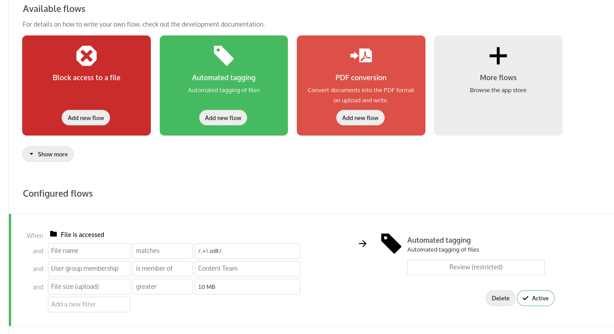

# Nextcloud Files Automated Tagging App

An app for Nextcloud that automatically assigns tags to newly uploaded files based on some conditions.

The tags can later be used to control retention, file access, automatic script execution and more.

## How it works
To define tags, administrators can create and manage a set of rule groups. Each rule group consists of one or more rules combined through operators. Rules can include criteria like file type, size, time and more. A request matches a group if all rules evaluate to true. On uploading a file all defined groups are evaluated and when matching, the given tags are assigned to the file.
